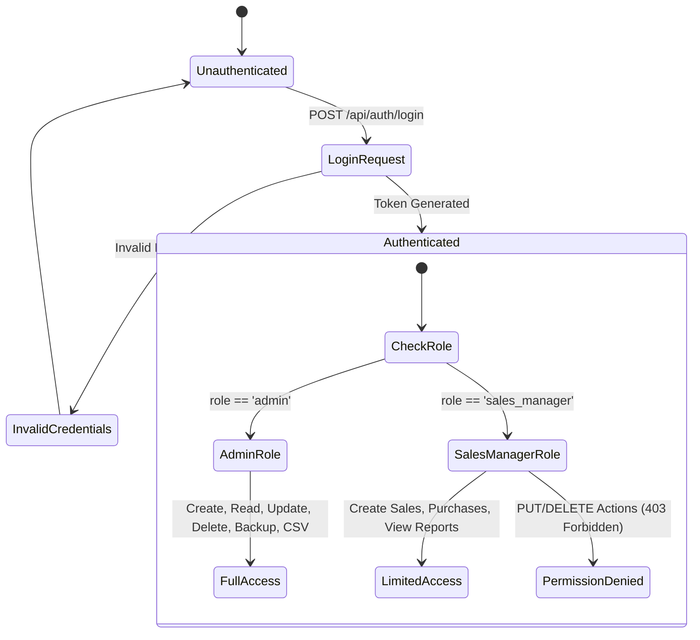
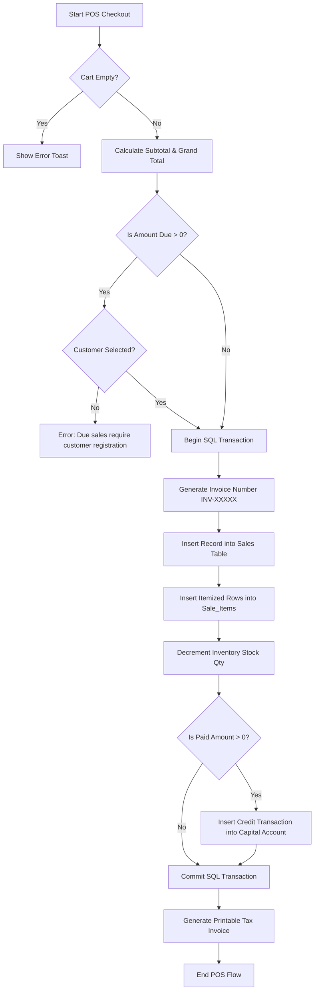

# Technical Documentation — Islam Enterprise ShopERP

**System Version**: 2.0.0  
**Author**: Islam Enterprise Engineering Team  
**Architecture**: Monolithic Zero-Dependency SPA + REST Engine  
**Database**: SQLite 3 (WAL Mode via `node:sqlite`)  

---

## Table of Contents
1. [Project Overview & README](#1-project-overview)
2. [System Architecture Document](#2-system-architecture-document)
3. [Database Schema & Data Dictionary](#3-database-schema--data-dictionary)
4. [Core Algorithms & Business Logic](#4-core-algorithms--business-logic)
5. [Flowcharts & State Diagrams](#5-flowcharts--state-diagrams)
6. [API Documentation](#6-api-documentation)
7. [Deployment & Security Guidelines](#7-deployment--security-guidelines)

---

## 1. Project Overview

**Islam Enterprise ShopERP** is an integrated Point of Sale (POS), Inventory Control, Customer/Supplier Ledger, and Multi-Account Financial ERP designed specifically for building material traders (rod, cement, brick, hardware).

### Core Highlights
- **Zero External Dependencies**: Operates exclusively using Node.js standard runtime libraries (`node:http`, `node:sqlite`, `node:crypto`, `node:fs`).
- **Role-Based Access Control (RBAC)**: Enforces permission boundaries between Admin and Sales Manager roles.
- **Multi-Account Capital Engine**: Real-time capital accounting across physical cash drawers and bank accounts.
- **Transactional CSV Engine**: Transaction-safe CSV import/export with automatic stock and ledger recalculation and atomic rollback.
- **Atomic Backup Engine**: WAL-checkpointed SQLite backup & restore module.

---

## 2. System Architecture Document

### Architectural Pattern
The application follows a **3-Tier Monolithic SPA (Single-Page Application)** architectural pattern:

```text
┌──────────────────────────────────────────────────────────┐
│                   CLIENT LAYER (Browser)                 │
│  Vanilla JS Single Page Application (app.js + DOM)       │
│  State Machine, Modal System, POS Cart, Printing Engine  │
└────────────────────────────┬─────────────────────────────┘
                             │ HTTP / REST API (JSON & CSV)
┌────────────────────────────▼─────────────────────────────┐
│                 APPLICATION SERVER LAYER                 │
│  Node.js Native HTTP Server (server.js)                   │
│  Auth Middleware, RBAC Guard, CSV Parser, Router         │
└────────────────────────────┬─────────────────────────────┘
                             │ Native SQLite Driver (node:sqlite)
┌────────────────────────────▼─────────────────────────────┐
│                   DATABASE LAYER (Storage)               │
│  SQLite 3 Database (data/shop.db)                        │
│  WAL Mode, Foreign Key Constraints, Indexing             │
└──────────────────────────────────────────────────────────┘
```

### Separation of Concerns

1. **Database Layer (`db.js`)**:
   - Manages physical SQLite storage connection via Node.js native `DatabaseSync`.
   - Enables Write-Ahead Logging (`PRAGMA journal_mode = WAL`) and Foreign Keys (`PRAGMA foreign_keys = ON`).
   - Declares table DDLs, auto-migrations, default indices, and initial seed records.

2. **API & Server Layer (`server.js`)**:
   - Low-latency HTTP server using native `node:http`.
   - Routing table mapping (`route(method, pattern, handler)`).
   - Bearer Token Session Authentication (`getAuthUser`) and Role Validation (`requireAuth`, `requireAdmin`).
   - Transaction wrappers (`transaction(fn)`) for atomic database operations.
   - Stream-based CSV parser/serializer and binary backup handlers.

3. **Client-Side UI Layer (`public/app.js`, `public/index.html`, `public/styles.css`)**:
   - Single-Page Application navigation router (`switchView`).
   - Modal management system with escape key and backdrop handlers.
   - Reactive view renderers (`renderDashboard`, `renderPOS`, `renderSales`, `renderAccounts`, etc.).
   - Browser printing engine formatting custom invoice DOM templates.

---

## 3. Database Schema & Data Dictionary

### Entity Relationship Diagram (Text Schema)

```text
  users (1) ───────────< sessions (N)
  users (1) ───────────< sales (N)
  customers (1) ───────< sales (N)
  accounts (1) ────────< sales (N)
  sales (1) ───────────< sale_items (N) ───────────> products (1)

  suppliers (1) ───────< purchases (N)
  accounts (1) ────────< purchases (N)
  purchases (1) ───────< purchase_items (N) ───────> products (1)

  accounts (1) ────────< account_transactions (N)
  customers/suppliers ─< payments (N) ────────────> accounts (1)
```

### Table Definitions

#### 1. `users`
| Column | Type | Constraints | Description |
| :--- | :--- | :--- | :--- |
| `id` | INTEGER | PRIMARY KEY AUTOINCREMENT | User unique ID |
| `username` | TEXT | NOT NULL UNIQUE | Login username |
| `password_hash` | TEXT | NOT NULL | SHA-256 password hash |
| `role` | TEXT | NOT NULL DEFAULT 'sales_manager' | Role (`admin` \| `sales_manager`) |
| `name` | TEXT | NOT NULL | Full name of user |
| `active` | INTEGER | NOT NULL DEFAULT 1 | Active status flag |
| `created_at` | TEXT | DEFAULT (datetime('now','localtime')) | Registration timestamp |

#### 2. `sessions`
| Column | Type | Constraints | Description |
| :--- | :--- | :--- | :--- |
| `token` | TEXT | PRIMARY KEY | Random 64-char hex token |
| `user_id` | INTEGER | NOT NULL FK -> users(id) | Associated user ID |
| `created_at` | TEXT | DEFAULT (datetime('now','localtime')) | Session creation time |

#### 3. `accounts`
| Column | Type | Constraints | Description |
| :--- | :--- | :--- | :--- |
| `id` | INTEGER | PRIMARY KEY AUTOINCREMENT | Account unique ID |
| `name` | TEXT | NOT NULL | Account title (e.g. Cash at Shop) |
| `type` | TEXT | NOT NULL DEFAULT 'cash' | Account type (`cash` \| `bank` \| `other`) |
| `account_number` | TEXT | DEFAULT '' | Bank acct number / IBAN |
| `opening_balance` | REAL | NOT NULL DEFAULT 0 | Initial capital balance |
| `active` | INTEGER | NOT NULL DEFAULT 1 | Active status flag |

#### 4. `account_transactions`
| Column | Type | Constraints | Description |
| :--- | :--- | :--- | :--- |
| `id` | INTEGER | PRIMARY KEY AUTOINCREMENT | Transaction ID |
| `account_id` | INTEGER | NOT NULL FK -> accounts(id) | Target account ID |
| `type` | TEXT | NOT NULL | Transaction type (`deposit`, `withdrawal`, `transfer_in`, `transfer_out`, `sale_collection`, `purchase_payment`, `expense`, `due_payment`) |
| `amount` | REAL | NOT NULL | Monetary amount |
| `related_account_id` | INTEGER | FK -> accounts(id) | Counterparty account ID for transfers |
| `ref_type` | TEXT | DEFAULT '' | Source module (`sale`, `purchase`, `payment`, `expense`) |
| `ref_id` | INTEGER | - | Source record ID |
| `date` | TEXT | NOT NULL | Transaction date (`YYYY-MM-DD`) |
| `note` | TEXT | DEFAULT '' | Memo / Note |

#### 5. `products`
| Column | Type | Constraints | Description |
| :--- | :--- | :--- | :--- |
| `id` | INTEGER | PRIMARY KEY AUTOINCREMENT | Product ID |
| `name` | TEXT | NOT NULL | Product name (e.g. MS Rod 10mm) |
| `category` | TEXT | NOT NULL DEFAULT 'other' | Category (`rod` \| `cement` \| `other`) |
| `brand` | TEXT | DEFAULT '' | Manufacturer brand |
| `size` | TEXT | DEFAULT '' | Specification (e.g. 10mm, 50kg bag) |
| `unit` | TEXT | NOT NULL DEFAULT 'pcs' | Measurement unit (`kg`, `bag`, `ton`, `pcs`) |
| `purchase_price` | REAL | NOT NULL DEFAULT 0 | Cost price per unit |
| `retail_price` | REAL | NOT NULL DEFAULT 0 | Retail price per unit |
| `wholesale_price` | REAL | NOT NULL DEFAULT 0 | Wholesale price per unit |
| `stock_qty` | REAL | NOT NULL DEFAULT 0 | Available inventory stock |
| `low_stock_alert` | REAL | NOT NULL DEFAULT 0 | Alert threshold quantity |

#### 6. `customers` & `suppliers`
| Column | Type | Constraints | Description |
| :--- | :--- | :--- | :--- |
| `id` | INTEGER | PRIMARY KEY AUTOINCREMENT | Party ID |
| `name` | TEXT | NOT NULL | Full Name / Business Name |
| `phone` | TEXT | DEFAULT '' | Contact Phone |
| `address` | TEXT | DEFAULT '' | Address |
| `type` | TEXT | DEFAULT 'retail' | Customer Tier (`retail` \| `wholesale`) |

#### 7. `sales` & `sale_items`
- **`sales`**: `id`, `invoice_no` (UNIQUE), `customer_id`, `customer_name`, `sale_type`, `date`, `subtotal`, `discount`, `total`, `paid`, `account_id`, `note`, `created_by`.
- **`sale_items`**: `id`, `sale_id` (FK), `product_id` (FK), `product_name`, `unit`, `qty`, `unit_price`, `unit_cost` (cost basis snapshot), `line_total`.

#### 8. `purchases` & `purchase_items`
- **`purchases`**: `id`, `ref_no`, `supplier_id`, `supplier_name`, `date`, `total`, `paid`, `account_id`, `note`, `created_by`.
- **`purchase_items`**: `id`, `purchase_id` (FK), `product_id` (FK), `product_name`, `unit`, `qty`, `unit_cost`, `line_total`.

#### 9. `payments` & `expenses`
- **`payments`**: `id`, `party_type` (`customer` \| `supplier`), `party_id`, `date`, `amount`, `method`, `account_id`, `note`.
- **`expenses`**: `id`, `date`, `category` (`rent`, `salary`, `transport`, `utility`, `other`), `amount`, `account_id`, `note`.

---

## 4. Core Algorithms & Business Logic

### A. POS Sales Processing Algorithm

```text
Algorithm ProcessSale(input):
  1. BEGIN SQL TRANSACTION
  2. Subtotal = SUM(item.qty * item.unit_price for item in input.items)
  3. Total = Subtotal - MIN(input.discount, Subtotal)
  4. Paid = MIN(input.paid, Total)
  5. Due = Total - Paid

  6. IF Due > 0 AND input.customer_id is NULL:
       THROW ERROR "Credit sales require a registered customer"

  7. Generate Unique Invoice Number "INV-XXXXX"
  8. INSERT INTO sales (invoice_no, customer_id, total, paid, account_id, ...)
  9. FOR EACH item IN input.items:
       Fetch Product from DB
       INSERT INTO sale_items (sale_id, product_id, qty, unit_price, unit_cost, line_total)
       UPDATE products SET stock_qty = stock_qty - item.qty WHERE id = item.product_id

 10. IF Paid > 0 AND input.account_id IS NOT NULL:
       INSERT INTO account_transactions (account_id, type='sale_collection', amount=Paid, ref_type='sale', ref_id=SaleID)

 11. COMMIT SQL TRANSACTION
```

### B. Profit & Loss (P&L) Calculation Logic

Financial metrics are derived dynamically over any date range `[FromDate, ToDate]`:

1. **Revenue ($R$)**:
   $$\text{Revenue} = \sum_{\text{sales in range}} \text{sale.total}$$

2. **Cost of Goods Sold ($\text{COGS}$)**:
   $$\text{COGS} = \sum_{\text{sale\_items in range}} (\text{item.qty} \times \text{item.unit\_cost})$$
   *(Note: `unit_cost` is snapshotted at the exact time of sale, protecting profit reporting from future price changes).*

3. **Gross Profit ($GP$)**:
   $$\text{Gross Profit} = \text{Revenue} - \text{COGS}$$

4. **Total Operating Expenses ($E$)**:
   $$\text{Total Expenses} = \sum_{\text{expenses in range}} \text{expense.amount}$$

5. **Net Profit ($NP$)**:
   $$\text{Net Profit} = \text{Gross Profit} - \text{Total Expenses}$$

---

## 5. Flowcharts & State Diagrams

### User Authentication & Role-Based Access Control



### POS Checkout Execution Flow



---

## 6. API Documentation

### Authentication Endpoints

#### `POST /api/auth/login`
- **Request Body**:
  ```json
  { "username": "admin", "password": "admin123" }
  ```
- **Response (200 OK)**:
  ```json
  {
    "token": "4f9a7b...",
    "user": { "id": 1, "username": "admin", "name": "System Admin", "role": "admin" }
  }
  ```

---

### Inventory / Product Endpoints

#### `GET /api/products?search=rod`
- **Response (200 OK)**:
  ```json
  [
    {
      "id": 1,
      "name": "MS Rod 10mm",
      "category": "rod",
      "brand": "BSRM",
      "size": "10mm",
      "unit": "kg",
      "purchase_price": 87,
      "retail_price": 94,
      "wholesale_price": 91,
      "stock_qty": 450,
      "low_stock_alert": 100
    }
  ]
  ```

#### `POST /api/products` *(Admin / Sales)*
- **Request Body**:
  ```json
  {
    "name": "Cement OPC",
    "category": "cement",
    "brand": "Shah",
    "size": "50kg bag",
    "unit": "bag",
    "purchase_price": 480,
    "retail_price": 540,
    "wholesale_price": 520,
    "stock_qty": 100,
    "low_stock_alert": 20
  }
  ```

---

### Capital Accounts & System Endpoints

#### `GET /api/accounts`
- **Response (200 OK)**:
  ```json
  [
    { "id": 1, "name": "Cash at Shop", "type": "cash", "current_balance": 35000.50 },
    { "id": 2, "name": "Bank Account", "type": "bank", "current_balance": 150000.00 }
  ]
  ```

#### `GET /api/system/backup` *(Admin Only)*
- Downloads live `shop.db` file as binary `application/x-sqlite3`.

#### `POST /api/system/restore` *(Admin Only)*
- **Headers**: `Content-Type: application/x-sqlite3`
- **Body**: Binary `.db` file buffer.

---

## 7. Deployment & Security Guidelines

### Production Deployment
1. **Process Management**:
   Use **PM2** for process supervision, auto-restart, and log rotation:
   ```bash
   npm install -g pm2
   pm2 start server.js --name "shoperp"
   pm2 save
   pm2 startup
   ```

2. **Reverse Proxy (Nginx Setup)**:
   Place Nginx in front of Node.js for SSL/TLS termination:
   ```nginx
   server {
       listen 443 ssl http2;
       server_name erp.islamenterprise.com;

       ssl_certificate /etc/letsencrypt/live/erp.islamenterprise.com/fullchain.pem;
       ssl_certificate_key /etc/letsencrypt/live/erp.islamenterprise.com/privkey.pem;

       location / {
           proxy_pass http://127.0.0.1:3000;
           proxy_set_header Host $host;
           proxy_set_header X-Real-IP $remote_addr;
       }
   }
   ```

### Security Hardening
- **Password Security**: Passwords are salted and hashed using `SHA-256`.
- **SQL Injection Prevention**: All queries utilize parameterized statements (`db.prepare('... WHERE id = ?').get(id)`).
- **Session Protection**: Bearer tokens are cryptographically generated 256-bit random hex strings.
